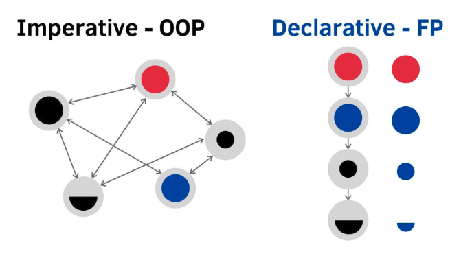

# 函數式程式設計 (Functional programming)   
OOP 偏向更大觀點的抽象， FP 則偏向實作細節的抽象。   
  把 Function 抽象化並極小化。   
透過「最小化」來增進程式碼的可讀性，FP 使用大量的 Function，幾乎每個 Function 都可以由更小的 Function 組合出來，Function 之間不會互相共用 state 狀態。
**純函數**和**不可變性**，**"One input, one output"**，不管輸入幾次同樣值，回傳結果永遠相同，單純返回值，可以不用細讀內容，只關注頭尾，就可以知道此方法在做什麼事情。   
[參考文章](https://ithelp.ithome.com.tw/users/20106426/ironman/3024?page=1)   
   
範例：output 轉大寫和轉小寫的方法   
```
// Old Way
const transform1 = (str) => {
  if(typeof str === 'string'){
    return `${str.toUpperCase()}!`; 
  }
  return 'Not a string'
}

const transform2 = (str) => {
  if(typeof str === 'string'){
    return `${str.toLowerCase())}!`; 
  }
  return 'Not a string'
}

transform1('hello world'); // "HELLO WORLD !"
transform2('hello world'); // "hello world !"
```
```
// FP
const toUpper = str => str.toUpperCase()  
const toLower = str => str.toLowerCase() 
const exclaim = str => str + '!'
const isString = str => typeof str === 'string' ? str : 'Not a string'

let transform1 = pipe(
  isString,
  toUpper,
  exclaim
)

let transform2 = pipe(
  isString,
  toLower,
  exclaim
);

transform1('hello world'); // "HELLO WORLD !"
transform2('hello world'); // "hello world !"
```
   
 --- 
   
## 宣告式 (Declarative)   
- 宣告式 (Declarative)：可以直接知道做了 "什麼"。
常運用表達式，表達式特色是單純運算並一定會有返回值。
   
- 命令式 (Imperative)：著重 "如何" 達到預期結果。
狀態互相依賴。
   
    
   
   
 --- 
   
## 規範   
- Pure Function。   
- 單純返回值，避免大量狀態運算。   
- 避免迴圈 (但是 map、reduce 高階函式可以)，也可遞迴 (if…else)。   
- 不會共用彼此的狀態和引用外部狀態。   
- 需是穩定、不可變動的，且避免副作用 (Side Effects)。
儘可能讓 Side Effect 能有好的管控，不要出現預期外的 Side Effect 。
   
- Pure Function 的組合體。   
   
   
 --- 
   
## 不可變動資料 (Immutable data)   
創建後就不可更動到資料。   
複製出一個新陣列/物件在進行處理，若是大量資料處理則會耗費很多記憶體。   
```
// native method mutable array
const newColor = colors.push('purple', 'green');
 
console.log(colors) // ['red', 'yellow', 'blue', 'purple', 'green']
console.log(newColor) // 5 <- 陣列長度
```
```
// immutable
const purePush = (arr, newEntry) => [...arr, ...newEntry];
const newColor = purePush(colors, ['purple', 'green'])

console.log(colors) // ['red', 'yellow', 'blue']
console.log(newColor) // ['red', 'yellow', 'blue', 'purple', 'green']
```
   
 --- 
   
## 純函數 (Pure Function)   
不管輸入什麼值 (input) 都一定會有相對應的結果 output。   
不會引用外部狀態、共用狀態，單純運算後回傳一個值。   
   
 --- 
## 副作用 (Side Effect)   
## 無狀態 (Stateless)   
## 高階函數 HOF (Higher-order function)   
## HOC (Higher-Order Component)   
## 柯里化 (Currying)   
## 組合 (Composition)   
   
 --- 
   
## Compose vs. Pipe   
- Compose：從右到左執行   
   
```
// 方法一
const compose = (a, b, c) => x => a(b(c(x)));
// 方法二
const compose = (...fns) => (x) => fns.reduceRight((v, f) => f(v), x);

```
   
- Pipe：從左到右執行，使用上更為直覺。   
   
```
// 方法一
const pipe = (a, b, c) => x => c(b(a(x)));
// 方法二
const pipe = (...fns) => (x) => fns.reduce((v, f) => f(v), x);
```
   
 --- 
   
## 沒有參數 (Pointfree)   
過程抽象化，函式組合中間運算的過程中不需要 data 的帶入的概念。   
   
 --- 
   
## 函子 (Functor)   
傳入一個函式改變內部的資料，但維持外殼不變，輸入輸出的數據結構相同 (type 相同)   
**fmap**   
狀態維持在 function 裡面   
```
/**
@parm {value} x
*/
const Box = x => ({
  map: f => Box(f(x)),
  value: x // 只是容易看值用而已
})

Box('a')
.map(x => x.toUpperCase())
.value;  //'A'
```
### **Applicative (加強版的 Functor)**   
   
 --- 
   
## Monad   
typeclass   
   
 --- 
   
# FP 套件   
## Ramda   
"function first，data last"   
- 函式自動 Curry 化。   
- filter、map、reverse、last、compose、pipe 等方法。   
   
   
