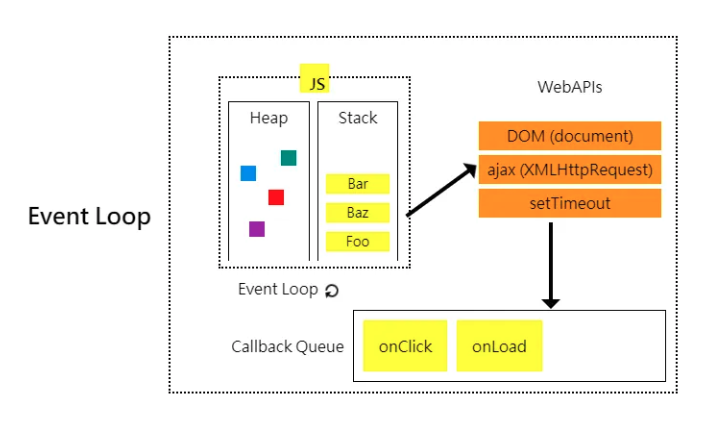
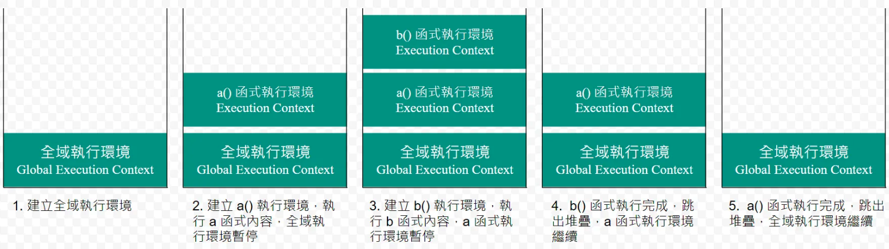

# 瀏覽器中的事件循環 (Event Loop)   
JS 是單執行緒語言 (單線程)。
可使用 worker.js 來另開線程。   
   
## 事件循環 (Event Loop)   
JS 執行如果遇到非同步任務，就會將任務放到事件佇列裡面排隊等待處理，等到目前堆疊的任務已清空執行完畢，就會將事件佇列裡面的任務放到堆疊裡面執行。   
只要執行堆疊清空了之後，就會讀取事件佇列裡面的任務，不斷重複這個步驟，直到所有任務完成，整個流程就是事件循環。   
    
###    
### 事件堆疊 (Call Stack)   
執行一個函式就會放進堆疊上方，函式執行結束之後，就會移除堆疊中，放進堆疊的函式是「後進先出」。   
從堆疊中移出不一定意味著立即釋放記憶體。垃圾回收器會在適當的時機檢查和釋放那些不再被引用的物件。   
    
##    
### 阻塞 (Blocking)   
在堆疊最上方的任務還沒結束之前，瀏覽器沒辦法做任何其他的事情，好像卡住了，就可以稱為阻塞。   
##    
### 事件佇列 (Event Queue)   
存放非同步任務的地方。   
   
### 記憶體 (Heap)   
在程式中宣告、定義變數、函式…等的記憶體位置。
從呼叫堆疊中移出後，該函式內部的局部變數和閉包引用的資源會根據 JS 的垃圾回收機制（Garbage Collection）來決定是否釋放。   
垃圾回收機制 (GC) 會不定時自動處理不再被引用的物件，以釋放記憶體。   
   
   
 --- 
   
## 非同步 (asynchronous)   
微任務會比宏任務優先執行。   
  微任務 → 宏任務   
### 宏任務 (Macro Task)   
- script   
- setTimeout   
- setInterval   
- I/O   
- 事件   
- postMessage   
- MessageChannel   
   
   
### 微任務 (Micro Task)   
- Promise.then   
- MutaionObserver   
   
   
延伸題：   
  - requestAnimationFrame：觸發時間點在下次頁面重繪之前 (style calculation、layout、paint 這些渲染步驟前)，跟任務列隊關係比較小，和頁面重繪關係比較大。   
  - requestIdleCallback：瀏覽器渲染後，如果有閒餘時間時則會觸發。   
