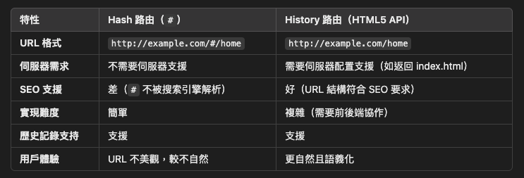
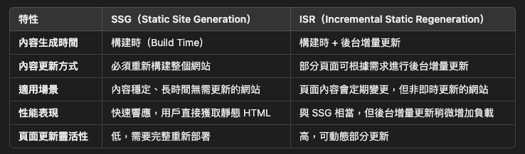
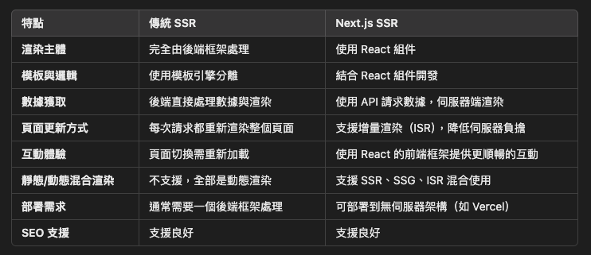

# 網頁渲染模式   
## 傳統 SSR（Server-Side Rendering，伺服器端渲染）   
由後端控制渲染，通常依賴後端框架和模板引擎來生成 HTML   
### 優點   
- 對 SEO 佳   
- 對瀏覽器的負擔較低   
- 首次載入較快   
   
   
### 缺點   
- 伺服器負擔較重   
- 用戶體驗較差   
- 頁面切換速度較慢   
- 前端和後端的分離程度低   
- router 由伺服器設定   
   
   
### MPA（Multi-page application，多頁應用程式）   
   
   
 --- 
## CSR（Client-Side Rendering，客戶端渲染）   
HTML 由伺服器發送，但內容需要 JavaScript 在用戶端動態生成   
### 優點   
- 伺服器負擔較輕   
- 用戶體驗較佳   
- 頁面切換速度較快   
- 前端和後端的分離程度高   
- router 由瀏覽器設定   
   
   
### 缺點   
- 對 SEO 較差   
- 對瀏覽器的負擔較高   
- 首次載入較慢   
   
   
### SPA（**Single Page Application**，單頁應用程式）   
SPA 是一種網頁應用架構，整個應用只有一個 HTML 頁面，頁面的動態更新由 js 在用戶端處理，而不是通過伺服器返回新的 HTML   
SPA 是網站架構方式，大多數 SPA 用的是 CSR，但不是所有 CSR 網站都是 SPA（例如 CSR 的 MPA）   
   
### 路由   
URL 的格式有兩種常見方式：   
    
   
HTML5 History API：   
- 相較於 Hash router 更利於 SEO 一點，需輔以預渲染 (Pre-rendering) 或動態渲染(Dynamic Rendering) 技術   
- 需要伺服器支援動態路由，否則直接訪問 `http://example.com/home` 會返回 404   
   
   
 --- 
## SSG（Static Site Generation，靜態網站生成）   
預先生成靜態 HTML 的渲染方式，生成的頁面在部署後直接提供給用戶端，無需額外的伺服器端處理   
   
### 優點   
- HTML 頁面可直接從 CDN 提供   
- SEO 友好，靜態 HTML 對搜尋引擎更友好   
- 簡單高效，適合內容固定的網站   
   
   
### 缺點   
- 內容變更需要重新構建（build）   
- 不適合需要頻繁更新或即時數據的場景   
   
   
### ISR（Incremental Static Regeneration，增量靜態生成）   
SSG 的進階版，解決 SSG 的缺點   
- 頁面會預先生成靜態內容，且可以定期更新   
   
   
兩者差異：   
    
   
 --- 
## 現代 SSR（Modern SSR）   
改進傳統伺服器端渲染，傳統 SSR 和 CSR 的結合，解決傳統 SSR 和 CSR 的缺點   
> React Next.js、Vue Nuxt.js   

   
### 優點   
- 對 SEO 佳   
- 對瀏覽器的負擔較低   
- 支援 SSR、SCR、 SSG、ISR 混合使用   
- 降低伺服器負擔   
- 用戶體驗佳   
- 解決傳統 SSR 頁面切換速度較慢的問題   
- 可前後端分離   
- router 由前端設定   
   
   
兩者差異：   
    
