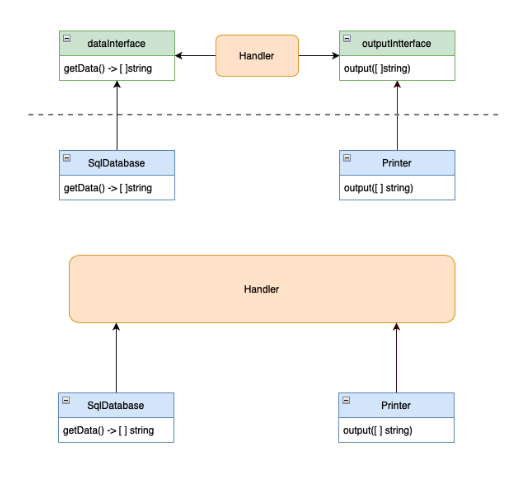
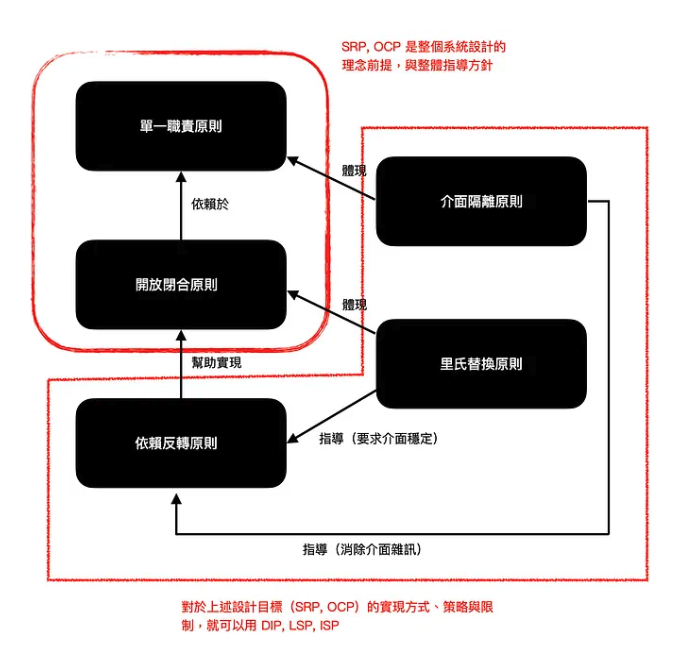

#  物件導向設計 (SOLID)   
其實就是一種管理程式碼的「管理方法」   
## 概念   
- 單一職責原則（Single Responsibility Principle，SRP）
介面只負責一個任務，讓處理的範圍縮小，拆成獨立的方法，**拆成獨立的方法**。   
- 開放封閉原則（Open-Closed Principle，OCP）
介面需要可以**開放擴充的彈性**，不去修改到原有的架構。   
- 里氏替換原則（Liskov Substitution Principle，LSP）
子類別必須可以替換父類別的功能，子類別必須擁有父類別的全部屬性和方法，子類如果覆寫父類方法，必須不能失去父類功能，**避免繼承盡量利用組合**。
繼承會產生高耦合，所以依照此原則才不會有意外的錯誤才不會有意外的錯誤。   
- 介面隔離原則（Interface Segregation Principle，ISP）
物件之間的依賴不應有用不到的功能，所以需透過抽象介面將實作隱藏。
**為個別的使用方設置其專屬的功能介面，來避免多個介面彼此干擾**。
   
- 依賴反轉原則（Dependency Inversion Principle，DIP）
物件的依賴關係都應該**依賴於抽象**，來降低耦合度。
[參考](https://www.appcoda.com.tw/dependency-inversion-principle/)   
        
    
   
介面：定義功能   
抽象類別：定義子類別的輪廓   
子類別：細節實作   
   
 --- 
   
## 設計模式  (Design Pattern)   
- 工廠模式 (Factory method pattern)
一個 function 建立一個東西。   
- 簡單工廠模式 (Simple Facrtory)
使用分類去產對應的東西。   
- 抽象工廠模式 (Abstract factory pattern)
多種類的東西組合在一個工廠裡面。
**接下來可以將邏輯拆出，資料用 mapping 的方式帶入，做解耦的動作。**   
- 單一實例模式 (Singleton)
共用實體，全域操作，不浪費記憶體，store 就是此概念。
   
   
```
// 共用同一個物件實體
// 產出一個物件
const obj = function() {
  return {
    name: '123'
  }
}

// 單例模式 (cache 的概念並加上封裝)
const objSingleten = (function() {
  let instance = null;
  return function() {
    if(!instance) {
      instance = new obj();
    }
    return instance;
  }
}())
```
### 結構設計    
封裝跟包一層達成的結構設計   
- 轉接器模式 (Adapter Pattern)
介接不同的第三方方法，統一一個接口。
實作新的介面來轉換一個對象的接口，以便另一個對象可以理解它可以正常使用 (解決不相容的困境)。
[參考](https://medium.com/starbugs/%E7%94%A8-javascript-%E7%8E%A9%E8%BD%89%E8%A8%AD%E8%A8%88%E6%A8%A1%E5%BC%8F-%E9%83%BD%E8%AE%8A%E6%88%90%E6%88%91%E6%83%B3%E8%A6%81%E7%9A%84%E6%A8%A3%E5%AD%90%E5%90%A7-adapter-pattern-%E8%BD%89%E6%8E%A5%E5%99%A8%E6%A8%A1%E5%BC%8F-118ef6fa45d3)    
   
例如：
使用 axios 串接 API，可將串接 API 的邏輯包裝起來，使用 callback function 執行，這樣當想要替換 axios 改用別的套件時，就可以只修改一個地方。   
- 橋接模式 (Bridge Pattern)
連接抽象與實做的橋梁，將實做隔離出來，透過注入，注入實做類別，可便利置換內容。
類似[依賴反轉](https://www.appcoda.com.tw/dependency-inversion-principle/)概念。   
- 組合模式 (Composite Pattern)
樹狀資料結構，大物件分解成多個具有相同操作的小物件，以一致的方式處理執行組合與個別物件。「部分－全體」層級關係。   
- 裝飾器模式 (Decorator Pattern)
在不修改原有程式碼的情況下增加邏輯。
裝飾器可讓您將業務邏輯建構成圖層，為每個圖層建立裝飾器，並在運行時使用該邏輯的各種組合來組合物件。
繼承是靜態的，我們不能在執行中動態地改變物件的行為，只能更換成另一種物件。通常使用聚合 (Aggregation) 或組 (Composition) 會是更好的選擇。
   
   
```
class Printer {
  print(text = '', style = '') {
    console.log(`%c${text}`, style);
  }
}

const yellowStyle = (printer) => ({
  ...printer,
  print: (text = '', style = '') => {
    printer.print(text, `${style}color: yellow;`);
  }
});

const boldStyle = (printer) => ({
  ...printer,
  print: (text = '', style = '') => {
    printer.print(text, `${style}font-weight: bold;`);
  }
});

const bigSizeStyle = (printer) => ({
  ...printer,
  print: (text = '', style = '') => {
    printer.print(text, `${style}font-size: 36px;`);
  }
});

```
- 外觀模式 (Facade Pattern)
將複雜的實作邏輯包裝起來，提供簡化的介面，方便外部使用，套件常會使用到，例如 jQuery。   
- 享元模式 (Flyweight Pattern)
屬於單一實例模式 (Singleton) 的延伸。
共用一個主體，內容可以被替換，避免重複、資源消耗。
透過固定的東西封裝在裡面，讓外部替換東西。   
- 代理模式 (Proxy Pattern)
當物件被修改時可被通知，像是在物件外包一層代理，多一層守門員。實現介面隔離、開放擴充概念。   
