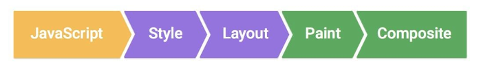

# 效能 (Performance)   
## 渲染 (Render)   
瀏覽器繪製頁面的流程：   
    
- JavaScript：用 JavaScript 修改 DOM 和 CSS 產生動畫   
- Style calculations：計算每個元素的 Computed style   
- Layout：計算元素的位置、大小   
- Paint：將元素的文字、顏色、圖片等等繪製在多個 Layer 上   
- Compositing：以正確的順序將 Layers 合併   
   
   
### 重排 (Reflow)、重繪 (Repaint)   
`transition` 會在動畫的過渡期間多次觸發 reflow 和 repaint。   
不設定 `transition` 則只會觸發一次。   
   
### 圖層 (Layers)   
瀏覽器只重繪有改變的 Layer。   
所以如果每個元素都可以獨立一個 Layer，就可以減輕效能負擔，但副作用是每新增一個 Layer 都會增加記憶體。   
   
會獨立 Layer 的樣式：   
不會影響到 Layout 和 Paint 階段而造成重排 (reflow)、重繪 (repaint)，會直接在 Composite 進行圖層合成。   
- `transform`   
- `opacity`   
- `will-change: 指定屬性;`   
- `transform: translateZ(0);`   
   
   
CSS style 會觸發哪些渲染階段列表：[CSS Trigger](https://csstriggers.com/)   
   
 --- 
   
## 動畫 (Animation)   
### FLIP    
[文章](https://aerotwist.com/blog/flip-your-animations/)   
- First：記錄動畫的初始狀態。   
- Last：記錄動畫的結束狀態。   
- Invert：使用 `transform` 和 `opacity` 回到初始狀態。   
- Play：使用 `transform` 讓元素從反轉位置 (初始狀態) 過渡到 `transform: none` 
 (實際的結束狀態，也就是先前在 L 時加上的 class 結束狀態)，在播放時加上 transition 來處理平滑過渡的效果。   
   
> 以上流程皆為瞬時的。   

   
如果動畫無法限制在 `transform` 和 `opacity`，可以使用此方法來優化變化過程，讓動畫過程更加流暢。   
將動畫開始和結束的狀態記錄起來，中間過程透過計算來執行。    
執行動態的過程消耗的效能較低 (因動態執行是使用 `transform` 和 `opacity` 進行過渡)，但是只有在開始和結束時效能消耗較高 (因取得元素狀態會需要進行重排和重繪)。   
   
F、Ｌ、Ｉ 計算需在 100ms 以內完成，因爲 100ms 是使用者感知變化的極限，超過 100ms 就會感知到變化。   
   
### **Web Animation API**   
[參考](https://blog.rex-tsou.com/blog/2016-03-24-introducing-web-animations-api-to-create-animations)   
可以使用 JS 來完成 CSS Animation 動畫，寫法概念和 CSS Animation 基本差不多，可以有 keyframes 影格的方法，相較 CSS Animation 更方便操控動畫。   
直接操作瀏覽器的渲染層 (Render Tree)，而不會影響到樣式計算的重排或重繪，效能更高。   
   
**細節控制動畫可以加入 requestAnimationFrame**   
使用 requestAnimationFrame 可以動態控制動畫進度或進行其他優化操作，像是在每一幀都拿到當前的動畫狀態。   
```
const box = document.getElementById('box');
const playButton = document.getElementById('play');
const pauseButton = document.getElementById('pause');
const progressDisplay = document.getElementById('progress');

// 定義動畫的起始和結束狀態
const keyframes = [
  { transform: 'translateX(0px)' },
  { transform: 'translateX(500px)' }
];

// 定義動畫選項
const options = {
  duration: 5000, // 動畫持續時間為 5 秒
  fill: 'forwards', // 動畫結束後保持最後狀態
  easing: 'linear' // 線性過渡
};

// 使用 Web Animation API 創建動畫
const animation = box.animate(keyframes, options);

// 默認暫停動畫
animation.pause();

// 使用 requestAnimationFrame 監控動畫進度
function monitorAnimation() {
  // 計算動畫進度（從 0 到 1）
  const progress = animation.currentTime / animation.effect.getTiming().duration;
  
  // 更新進度顯示
  progressDisplay.textContent = (progress * 100).toFixed(2) + '%';

  // 若動畫未完成，繼續監控
  if (!animation.finished) {
    requestAnimationFrame(monitorAnimation);
  }
}

// 監控按鈕點擊事件
playButton.addEventListener('click', () => {
  animation.play();  // 播放動畫
  requestAnimationFrame(monitorAnimation); // 開始監控
});

pauseButton.addEventListener('click', () => {
  animation.pause();  // 暫停動畫
});

// 初始化監控動畫的當前狀態
requestAnimationFrame(monitorAnimation);

```
###    
### FSP   
60fps（每秒 60 幀）表示每幀的渲染時間是 16.67ms 左右。   
   
**螢幕刷新率**   
如果你的螢幕刷新率是 60Hz，FPS 低於 60 時可能會顯得不太流暢，但如果是 120Hz 或更高刷新率的螢幕，你可能會在更高的 FPS 下感覺流暢。   
   
**穩定 AnimationFrame 每秒 60 幀更新**   
```
this.activePoints = new Set(); // 儲存當前活躍的點
this.lastFrameTime = 0; // 記錄上一幀動畫的時間戳
this.frameInterval = 1000 / 60; // 實現 60 FPS，所以每幀的時間間隔約為 16.67 毫秒

function drawDynamic() {
    // 計算兩幀之間的時間間隔
    if (!this.lastFrameTime) this.lastFrameTime = performance.now();
    const deltaTime = performance.now() - this.lastFrameTime;

    // 檢查是否需要跳過當前幀 (如果 deltaTime 小於每幀應有的時間間隔（16.67ms），則跳過這一幀，並呼叫 requestAnimationFrame 來安排下一幀)
    if (deltaTime < this.frameInterval) {
      this.requresAnimationFrameId = requestAnimationFrame(this.drawDynamic.bind(this, attackIp));
      return;
    }

    // 更新上一幀的時間
    this.lastFrameTime = performance.now();

	// 計數器 (實現時間相關的動畫效果)
    this.time++;
	// 清空畫布上的內容，為下一幀的繪製騰出空間
    this.ctx.clearRect(0, 0, this.canvas.width, this.canvas.height);
}

```
   
**performance.now()**   
- 是一個 Web API   
- 以瀏覽器生命週期開始計算 (不同瀏覽器取得的精度會不同)   
- 不會因系統時鐘修改而影響   
- 最高精度可以到微秒   
- 可小於 1ms   
- `Date.now()` 等於 `performance.timing.navigationStart + performance.now()`   
   
   
**Date.now()**   
- 是一個 JS 內建方法   
- 會因系統時鐘修改而影響   
- 以時間戳計算   
- 不會小於 1ms   
- 傳回自 1970 年 1 月 1 日 00:00:00 (UTC) 到目前時間的毫秒數   
   
   
   
