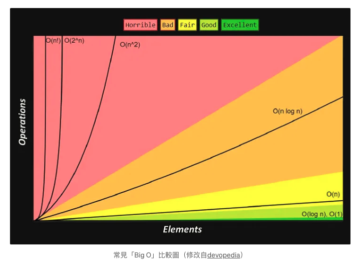

# 演算法 (Algorithm)   
## 複雜度（complexity）   
表示一演算法的效能，複雜度越低，代表演算法越好。   
   
## 空間複雜度（space complexity）   
演算法需要佔用多少記憶體空間。   
   
## 時間複雜度 (Big O notation)   
演算法執行次數的總執行時間。   
   
### 大 O 符號（Big O notation）   
記錄時間複雜度的快慢的指標。
   
    
- O(1)：只會執行一次。   
- O(log n)：二分搜尋法，每一步都將搜尋範圍減少一半，執行次數大約等於 `n / 2`。   
- O(n)：執行次數等於 `n`。   
- O(n²)：執行次數等於 `n \* n`，等於跑了兩次迴圈。   
- O(2^n)：執行次數等於 2 的 n 次方，隨著輸入規模 `n` 的增長，該算法的運行時間將以指數速度增加。當 `n` 增加時，所需的計算資源（例如時間）會呈指數級增長   
   
   
 --- 
   
## 迴圈   
### for   
> 通常來說，for 迴圈是最快的迴圈類型，因為它直接控制了迴圈的索引和迴圈次數，不涉及額外的迭代器   

- 可以遍歷任何具有 length 屬性的對象   
- 可用 break 或 return 中斷整個迴圈   
- 可用 continue 來中斷但繼續下一次迴圈   
   
   
### while   
- 遍歷條件為 true 的對象   
- 可用 break 或 return 中斷整個迴圈   
- 可用 continue 來中斷但繼續下一次迴圈   
   
```
let i = 0;
while (i < array.length) {
  // 操作 array[i]
  i++;
}

```
```
let i = 0;
do {
  alert( i );
  i++;
} while (i < 3);
```
   
### for…of   
- 主要用於遍歷可迭代對象（iterable 物件，例如陣列、字串、Set、Map 等，NodeList 也可以）   
- 可用 break 或 return 中斷整個迴圈並返回值   
- 可用 continue 來中斷但繼續下一次迴圈   
- 遍歷的是 value   
   
   
### forEach   
- 僅可以遍歷 Array 和 NodeList。 forEach 是 Array 的原型方法，因此只能用於 Array 或類別數組物件   
- 不會終止迴圈（return 只會中斷當前跑的迴圈，不會中斷整個迴圈）

   
   
### for…in   
> 會遍歷到繼承的屬性（解決方法就是用 hasOwnProperty 去篩選掉繼承的屬性）   
> 效能通常比較差，因為它不僅遍歷數組元素，還遍歷了原型鏈上的所有可枚舉屬性   
>    

- 可以遍歷可枚舉屬性 (Array、Object、NodeList)，遍歷的是屬性名稱（字串），而不是陣列的元素值，因此在處理陣列時可能會導致意外行為   
- 可用 break 或 return 中斷整個迴圈   
- 可用 continue 來中斷但繼續下一次迴圈   
- 遍歷的是 key（所以在用陣列上也沒有比較方便）   
   
   
 --- 
   
## 快取 (cache)   
記憶已執行過的計算方法。   
```
function cache(fn) {
  let resultMap = new Map();

  return (...args) => {
    const key = JSON.stringify(args); // 基於函數參數生成唯一鍵

    if (!resultMap.has(key)) {
      const result = fn(...args);
      resultMap.set(key, result);
      return result;
    } else {
      return resultMap.get(key);
    }
  };
}

function add(a, b) {
  return a + b;
}

const cachedAdd = cache(add);

console.log(cachedAdd(1, 2)); // 計算並緩存結果 3
console.log(cachedAdd(1, 2)); // 直接從緩存中獲取結果 3
console.log(cachedAdd(2, 3)); // 計算並緩存結果 5

```
   
