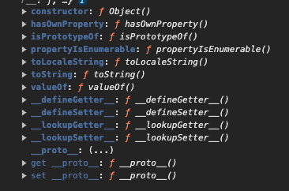

# 原型 (Prototype)   
##  概念   
- 原型鏈可以達到像是「繼承」的效果，可使用上層的 method。   
- 可以讓實體之間共享方法。   
- 非必要請不要更改原生原型。   
- 所有物件原型鏈最頂端為 Object。   
   
   
 --- 
   
## 靜態方法   
### 取得原型   
- `\_\_proto\_\_` (被視為過時且不建議使用)   
   
```
A.__proto__; // 顯示 A 的上層原型
A.__proto__ === B.prototype; // true/false


```
- Object.getPrototypeOf(obj);   
   
```
Object.getPrototypeOf(A) === B // true/false
```
   
### 設定原型   
Object.setPrototypeOf(obj, proto);   
將 obj 的 `[[Prototype]]` 設定為 `proto`。   
   
### 指定原型建立新物件   
Object.create(proto, {options});   
options 可以帶入原型描述   
```
let animal = {
  eats: true
};

let rabbit = Object.create(animal, {
  jumps: {
    value: true
  }
});

alert(rabbit.jumps); // true
```
   
### 原型描述   
- enumerable: false,   
- configurable: false,   
- writable: false,   
- value: 'value'   
   
   
取得原型描述方法：   
Object.getOwnPropertyDescriptors(obj);   
   
### 定義或修改物件中的屬性 (Object.defineProperty)   
Object.defineProperty(obj , propertyName , descriptor);   
   
 --- 
###    
## 物件原型提供的方法   
### Object.hasOwnProperty();   
是否是當前物件的屬性   
```
const object1 = {};
object1.property1 = 42;

console.log(object1.hasOwnProperty('property1'));
// Expected output: true

console.log(object1.hasOwnProperty('toString'));
// Expected output: false
```
陣列用法：   
```
const fruits = ["Apple", "Banana", "Watermelon", "Orange"];
fruits.hasOwnProperty(3); // true ('Orange')
fruits.hasOwnProperty(4); // false - not defined
```
   
### getter/setter   
> 可以從物件的原型中找到以下方法，只能對物件本身進行操作。   

- getter：讀取   
- setter：設定   
   
```
let obj = {
  _name: '我的名字',
  get myName() {
    console.log('Getting name');
    return this._name;
  },
  set myName(value) {
    console.log('Setting name');
    this._name = value;
  }
};

console.log(obj.myName); // "Getting name" 然後返回 '123'
obj.myName = '456'; // "Setting name" 然後更新 name


```
   
其餘還有 .toString()、.valueOf() 等方法。   
    
   
 --- 
   
## 建構子   
使用 new 的 function。
new 出來的就是實體。   
  可以繼承 Array，讓實體擁有 Array 方法 (push、pop、shift、forEach、filter、map 等)。   
1. 建立一個新的物件。   
2. 將物件的 `.\_\_proto\_\_` 指向建構子的 prototype，形成原型串鏈。   
3. 將建構子的 this 指向 new 出來的新物件。   
4. 回傳這個物件。   
   
   
判斷兩者實體是否相同：   
```
Object instanceof constructor

```
   
## Class   
ES6 誕生的語法糖。   
   
方法：   
- 私有變數 (無法被實體存取)：#variable   
- 繼承：super()   
- 靜態方法：static func()
(只存在 class 中，不能被實體所提取)
   
- getter/setter：get func()、set func()   
   
   
 --- 
##    
## 物件建立代理 (Proxy)   
相較於物件內建的 getter、setter，Proxy 可以對物件內的所有屬性進行操作 (`get`、 `set`、 `deleteProperty`、 `has`、 `apply` 等)。   
```
let obj = {
  name: '我的名字'
};

let proxyObj = new Proxy(obj, {
  get(target, prop) {
    console.log(`Getting ${prop}`);
    return target[prop];
  },
  set(target, prop, value) {
    console.log(`Setting ${prop} to ${value}`);
    target[prop] = value;
    return true;
  }
});

console.log(proxyObj.name); // "Getting name" 然後返回 '123'
proxyObj.name = '456'; // "Setting name to 456" 然後更新 name

```
   
