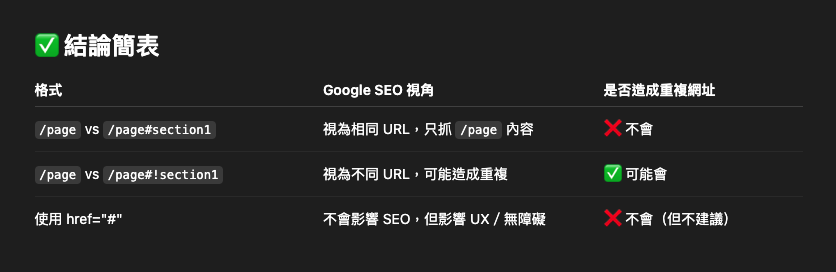

# 重複網址（Duplicate URLs）   
- 搜尋引擎誤認多個網址為重複內容   
- 分散權重（PageRank）   
- 減少整體收錄效率   
   
   
## href 格式   
### #!（Fragment with hashbang）   
- 早期（舊版 AJAX SEO）Google 曾支援特殊的 #! hashbang，會嘗試對應到 *escaped\_fragment*（已棄用）。   
- 現在不建議再使用 #! 這種格式，因為 Google 不再對這種 hashbang 特別處理。   
- 所以 \*\*帶有 #! 的 URL 通常會被視為「與無 hash 的 URL 不同」的「潛在重複內容」。   
   
### #（一般 hash fragment）   
- Google 不會索引 # 後的內容（也不會傳遞給伺服器），所以：   
   
```
https://example.com/page

https://example.com/page#section1

https://example.com/page#section2

```
三者在 SEO 角度是視為相同網址，只會索引 /page，其他被視為「同一頁不同位置」的導航用 fragment。   
- 所以不會造成「重複內容」問題。   
   
   
    
   
## 查詢字串（query string）   
Google 會把不同 query 參數的頁面視為不同的 URL，例如：   
```
/product-list?page=1

/product-list?page=2

/product-list?filter=a

```
這會造成：   
- Google 認為你有很多「內容類似」的頁面   
- 被判定為 重複內容（Duplicate Content）   
- 最終導致主頁 /product-list 排名不佳，或者不被收錄   
   
解決方法   
  加上 `<link rel="canonical">` 標籤   
  範例 (加在 HTML `<head>` 中)：   
  `<link rel="canonical" href="path/product-list">`   
  這樣即使是 `/product-list?page=2`、`?filter=xxx`、`?sort=desc&page=3` 等頁面，Google 只會收錄 `/product-list` 這個 canonical 網址，其餘會被視為「參考副本」。   
   
參考文章：   
- [如何使用 rel="canonical" 和其他方法指定標準網址](https://developers.google.com/search/docs/crawling-indexing/consolidate-duplicate-urls?hl=zh-tw)   
- [rel=canonical 的 5 大常見錯誤](https://developers.google.com/search/blog/2013/04/5-common-mistakes-with-relcanonical?hl=zh-tw)   
- [Canonical標準網址操作指南，操作SEO不再苦惱](https://www.awoo.ai/zh-hant/blog/canonical-seo/)   
   
   
