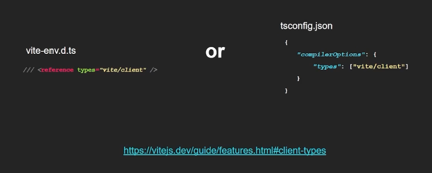

# JS 升級 TS 方法   
以 js + vite 為例：   
1. 安裝   
    ```
    npm install @typescript-eslint/parser @typescript-eslint/eslint-plugin
    
    eslint-plugin-import eslint typescript eslint-plugin-import @types/node -D
    ```
2. 執行 `npx tsc--init ` 進行專案 TS 格式化，會生成一個 `tsconfig.json` 設定檔   
3. `package.json` 中設定 `"build": tsc && vite build
`build 打包時才可以先進行 ts 檢查再進行 vite build   
4. `.eslintrc.cjs/.eslint.config.js` 設定   
    ```
    extends: ["eslint:recommended", "plugin:@typescript-eslint/recommended", "plugin:@typescript-eslint/stylistic",],
    parser: "@typescript-eslint/parser",
    plugins: ["import", "@typescript-eslint"],
    root: true,
    
    // 在 rules 加上關閉 TS  的設定
    rules: {
      "import/no-extraneous-dependencies": "off",
      "@typescript-eslint/no-unused-vars": "off",
      // 關閉 any ( https://typescript-eslint.io/rules/no-explicit-any/ )
      "@typescript-eslint/no-explicit-any": "off",
      // 關閉 ignore ( https://typescript-eslint.io/rules/ban-ts-comment/ )
      "@typescript-eslint/ban-ts-comment": "off",
      // https://typescript-eslint.io/rules/consistent-type-definitions/
      "@typescript-eslint/consistent-type-definitions": "off",
      // https://stackoverflow.com/questions/37826449/expected-linebreaks-to-be-lf-but-found-crlf-linebreak-style
      "linebreak-style": ["off", "windows"],
    }
    ```
5. 在 vscode settings.json 加上儲存自動 format 設定   
    ```
    "[typescript]": {
          "editor.formatOnSave": true,
          "editor.defaultFormatter": "esbenp.prettier-vscode"
    },
    ```
6. 安裝 `npm install vite-plugin-checker -D
`讓 TS 相關錯誤可以顯示於畫面中的彈窗中
讓 .tsx 檔略過不被 vite-plugin-checker 檢查方法：   
    - (方法一) 在**檔案最上方第一行**加上：   
        ```
        // @ts-nocheck
        
        ```
    - (方法二) 在 vite.config.ts 設定：   
        ```
        import checker from 'vite-plugin-checker';
        
        export default {
          plugins: [
            checker({
              typescript: {
                tsconfigPath: 'tsconfig.json',
                // ✅ 用 ignoreFileRegexp 排除
                ignoreFileRegexp: [/src\/views\/pages\/Usage\.tsx$/],
              },
            }),
          ],
        };
        
        ```
7. 到 `vite.config.js`   
    ```
    import checker from "vite-plugin-checker";
    
    export default defineConfig({
      root: "src",
      build: {
        target: "esnext",
        rollupOptions: {
          input: {
            main: resolve(__dirname, "src/index.html"),
          },
          output: {
            dir: resolve(__dirname, "dist"),
          },
        },
      },
      plugins: [
        checker({
          typescript: true,
        }),
        eslint(),
      ],
    });
    
    ```
8. 設定讓 TS 知道現在 vite 設定的型別確認
`/src/vite-env.d.ts`   
        
9. `tsconfig.json` 設定 (預設會有很多註解幾行，可逐行了解設定)   
    ```
    {
      "compilerOptions": {
        "target": "ES2020",
        "useDefineForClassFields": true,
        "skipLibCheck": true,
        "module": "ESNext",
        "lib": ["ES2020", "DOM", "DOM.Iterable"],
    
        /* Bundler mode */
        "moduleResolution": "bundler",
        "allowImportingTsExtensions": true,
        "resolveJsonModule": true,
        "isolatedModules": true,
        "noEmit": true,
    
        /* Linting */
        "strict": true,
        "noUnusedLocals": true,
        "noUnusedParameters": true,
        "noFallthroughCasesInSwitch": true,
    
        // 識別js檔案
        "allowJs": true,
        // 進行js檔案的型別檢查
        "checkJs": false
      },
      "include": ["src/**/*"]
    }
    ```
10. 執行 `npm i`、`npm run dev`   
11. 將 `.js` 改 `.ts`   
