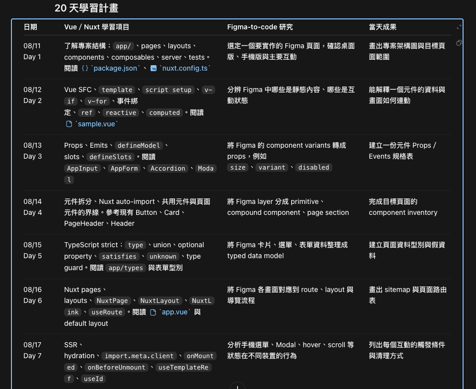
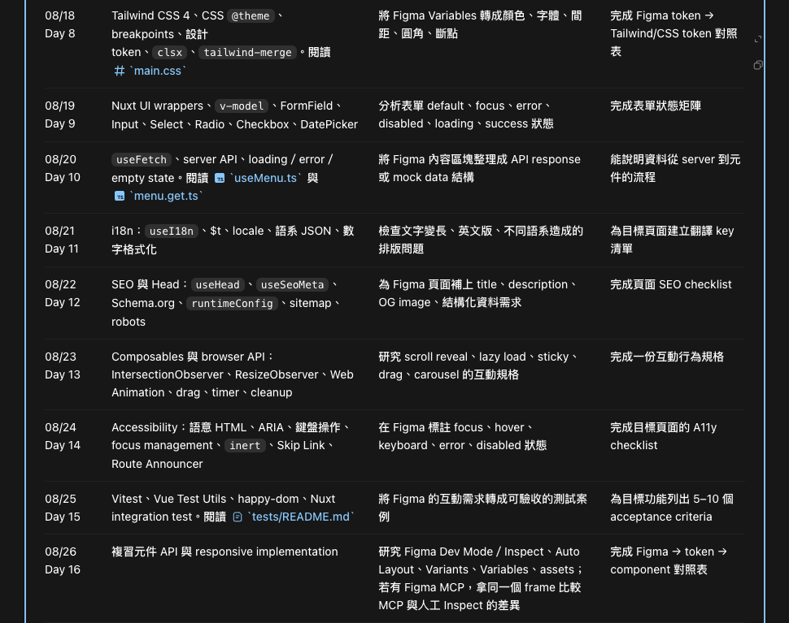
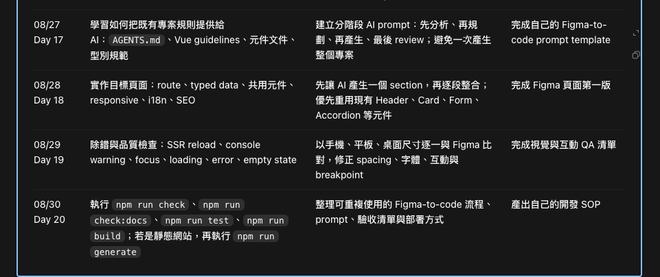

- 清快取按鈕，貼上指定要執行快取的檔案路徑
- 上線檢核表、檢測全站連結有無失效（頁面 status）
- 檢視網頁 HTML 結構/標籤的 chrome 擴充工具（方便看 h1-h6）
- 錄音轉逐字稿 ＋ 整理重點摘要工具
- GSD、SDD、TDD
- CI、CD
- Docker
- 自動化切版 (規範 AI)
- 重複性的流程 -> skill 工作流
- AI 安全性權限設定
- gitlab/github 企業版
- GEO
- 最後驗收（無障礙、效能、ai 檢索分數、功能完善性、console wrarning 問題列出是否修正）
--
Nuxt template
* Tailwind + clsx + merge
* meta og favicon title 設定
* 無障礙
* 資安 CSP
* Components 配用法 demo  (麵包削、page title、page header、spinner、page loading、pagination、accordion、toast、modal、btn、go top btn、card、marquee、骨架 lazy loading、slide tab、+ - counter、數字跑動 countup、編輯器、social share、datepicker、表單、image lightbox、yt 封面圖/自動播放參數、dropdown mnu 左右超出自動校正位置、empty state、error state)
* Composables / Utils (useHeaderHeight、useContainerSide、useGoTop、useDrag、useObserveFade、formatPrice、formatDate)
--
1. Core  
Nuxt config、SEO、favicon、env、error page、sitemap、robots、API wrapper  
  
2. Style System  
Tailwind、clsx、tailwind-merge、CSS variables、container、typography、RWD  
  
3. Accessibility / Security  
skip link、focus、ARIA、modal focus trap、CSP、security headers  
  
4. Components  
button、modal、toast、accordion、pagination、tabs、form、loading、card、breadcrumb...  
  
5. Composables / Utils  
useHeaderHeight、useContainerSide、useGoTop、useDrag、useObserveFade、formatPrice、formatDate
--

✓ Nuxt 建立

✓ ESLint
✓ Prettier
✓ TypeScript strict

✓ Tailwind
✓ clsx
✓ tailwind-merge

✓ app.vue SEO 預設

--
✓ error.vue
demo 頁
README

feat: initialize nuxt starter template

--
✓ sitemap、robots
✓ llms.txt
✓ JSON-LD

✓ nuxt llm.txt
✓ CSP
✓ CSS Reset

✓ 超過 8 個子選單就使用雙排結構
✓ 左右超出自動校正位置
✓ 加上會員、購物車、搜尋 icon（細節結構、功能尚未做）
✓ 手機版選單處理
✓ 新增無障礙 tab 功能
✓ header（dropdown mnu 左右超出自動校正位置，分手機版/電腦版）、footer
✓ 無障礙 ⚓️點（拆共用）

- ⏳ Components
	- ✓ accordion
	- ✓ 麵包削
	- ✓ pagination
	+ ✓ loading
	- ✓ spinner
	- ✓ lazyload 骨架
	- ✓ gotop
	- ✓ 按鈕
	- ✓ 卡片
	- ✓ 編輯器
	- ✓ toast
	- ✓ modal
	- ✓ tooltips
	- ✓ 跑馬燈
	- ✓ 升級 nuxt 4.5.1
	+ ✓ +- counter vs `InputNumber`
	+ ✓ 手機版電腦版圖片、影片/ifrme layload
	+ ✓ social share
	+ ✓ swiper vs `UCarousel`
	+ ✓ 拆 social share btn（功能、按鈕拆開）
	+ ✓ drag 功能
	- ✓ tab slide
	- ✓ 健檢 AGENTS.md、優化工作流的排程任務（結果 UI 網頁呈現）
	- ✓ yt 封面圖/自動播放參數
	- ✓ swiper init 只出現一個 slide 問題修正
	- ✓ count up
	- ✓ odometer
	+ ✓ empty state
	+ ✓ observe fade
	- 
	- ✓ 安裝 Nuxt UI
	- ✓ 下拉選單
	+ image lightbox
	- 
	+ ✓ datepicker
	+ ✓ 表單

- ✓ Pages（sitemap、privacy）

/btn
	/BaseBtn.vue（基本設定提供衍生元件使用）
	/BtnNormal.vue
	/BtnMain.vue
/icon
	/BaseIcon.vue
	/IconArrowDown.vue
	/IconCart.vue
/accordion
	/Accordion.vue（元件基本只會有一個，可透過各種 props 來做變體，直接使用該元件名稱，不使用任何 default、base 等前後綴）

----
✓ props 寫法（defineProps、withDefaults、Vue 3.5 的新語法 解構 props）
✓ emit
✓ v-bind（disabled:bg-slate-100、@update:active-items、v-model:active-items）
✓ 單向資料流（One-way Data Flow）

✓ 地址（縣市下拉選單、區域下拉選單、地址輸入）、身分證、統編、密碼、確認密碼欄位
✓ 千分位 methos、數字前綴 + 0
✓ stickyAnchor
✓ 測無障礙 agent browsing 評分

－－－
✓ cursor
✓ 建立元件 vitest（CI 範圍先不建立）
✓ 試試 /grill-me
[?] loading 生命週期
[?] AnyType 資料搬到 obsidian
✓ 常用 icon?（home、日立、電話、傳真、信箱、地點、地球、fb、ig、yt、LINE、x、複製、上傳、下載）
Nuxt coding 觀念練習、Flutter 學習
實作小練習、TODO LIST
安裝設定筆記（mac、vscode、AI）
NAS 啟用 docker -> Vaultwarden 自架密碼管理 server

[X] Pinia
[X] open wiki（專案架構較複雜時使用）
✓ sandbox
⏳ 整理 skills（自我測試驗證評分 evals）
context engineering

figma 設計稿 -> UI（skills/MCP）

－－－
> 擺放順序：import -> 官方/自定義的 compostion api(ex:useRouter) -> ref -> computed -> function -> watch -> onMounted -> onUnMounted
---

# Nuxt 專案建議

建議：

✅ `robots.txt`

✅ `sitemap.xml`

✅ `llms.txt`

✅ JSON-LD

✅ Canonical

✅ Open Graph

✅ Semantic HTML

✅ Accessibility

✅ Core Web Vitals

✅ CLS < 0.1

若使用 Nuxt，`llms.txt` 可以透過模組或 Nitro Route 自動產生，放置於網站根目錄（`/llms.txt`）即可。